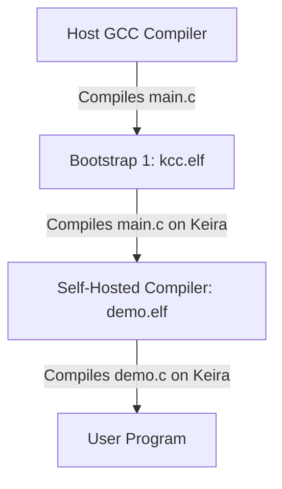

# Keira C Compiler (kcc) & Self-Hosting Architecture (v0.14.0)

This document describes the design, language subset, and self-compilation (self-hosting) architecture of the **Keira C Compiler (`kcc`)** in user space.

---

## 1. Design Philosophy

`kcc` is a lightweight, single-pass compiler that compiles a subset of the C programming language directly into statically linked 64-bit ELF64 executables for the x86_64 architecture.

To achieve self-hosting without the massive overhead of parsing the full C standard (which requires preprocessor parsing, complex struct alignments, type conversion casting, and dynamic linking), `kcc` is designed with two core strategies:
1. **Simplified Language Subset**: The compiler supports only the essential constructs needed to express a compiler (variables, pointers, arrays, loops, branches, and function calls).
2. **Refactored Compiler Source**: The compiler's own code is written purely within this simplified subset. It avoids complex structures (`struct`), unions, enums, and typedefs, relying instead on flat data structures (like parallel arrays).

---

## 2. Supported C Language Subset

`kcc` v0.14.0 compiles the following language constructs:

### 1. Types and Declarations
- **Data Types**: `int` (64-bit integer variables/values) and `char` (8-bit bytes).
- **Pointers**: `char *` and `int *`. Supports dereferencing using `*ptr` and pointer arithmetic.
- **Arrays**: 1D global arrays (e.g., `char src_buf[32768];`). Local arrays are not supported (avoided via global arrays in refactoring).

### 2. Operators and Expressions
- **Arithmetic**: `+`, `-`, `*`, `/` (using `imul`, `idiv` x86_64 opcodes).
- **Comparisons**: `<`, `>`, `==`, `!=` (compiled to `cmp` + conditional `setcc` + `movzx`).
- **Assignment**: `=`.
- **Character Literals**: Enclosed in single quotes (e.g. `'a'`, `'\n'`). Translated to numeric constants.
- **String Literals**: Enclosed in double quotes (e.g., `"Hello\n"`). Written to the data segment.

### 3. Control Flow
- **Branches**: `if` and `if/else` statements.
- **Loops**: `while (condition) { ... }` loops.

### 4. Functions & Parameters
- **Definitions**: Global functions can be defined and called.
- **Parameter Passing**: Supports up to 4 parameters. Arguments are passed using the standard System V x86_64 ABI registers:
  - Argument 1: `RDI`
  - Argument 2: `RSI`
  - Argument 3: `RDX`
  - Argument 4: `RCX`
- **Call Patching**: A call patch table tracks forward function calls, resolving and writing relative offsets (`0xe8` call) at the end of compilation.

### 5. Low-Level Builtin: `syscall`
To allow writing operating system utilities and system call wrappers (like `sys_open`) directly in C without inline assembly parsing, `kcc` implements a builtin function:
```c
int syscall(int num, unsigned long arg1, unsigned long arg2, unsigned long arg3);
```
When compiled, `syscall` loads arguments into RAX, RDI, RSI, RDX and emits the `syscall` (`0x0f 0x05`) instruction directly.

---

## 3. Self-Hosting Compilation Pipeline

The self-hosting compilation pipeline executes in two bootstrap phases:



### Phase 1: Host Compilation (Bootstrap 1)
During system build (`make`), the host GCC compiler compiles `user/apps/kcc/main.c` (linking standard headers) to produce the bootstrap compiler binary `build/kcc.elf`.

### Phase 2: Self-Compilation (Self-Hosted)
Inside the Keira OS environment, `run kcc` is executed.
1. The bootstrap compiler loads `/apps/src/demo.c` (which is a copy of `main.c`).
2. It parses the compiler's own code.
3. It emits `demo.elf` (which is the compiled compiler itself).
4. Running `/apps/bin/demo.elf` validates that the compiler successfully compiled itself and is fully functional.
